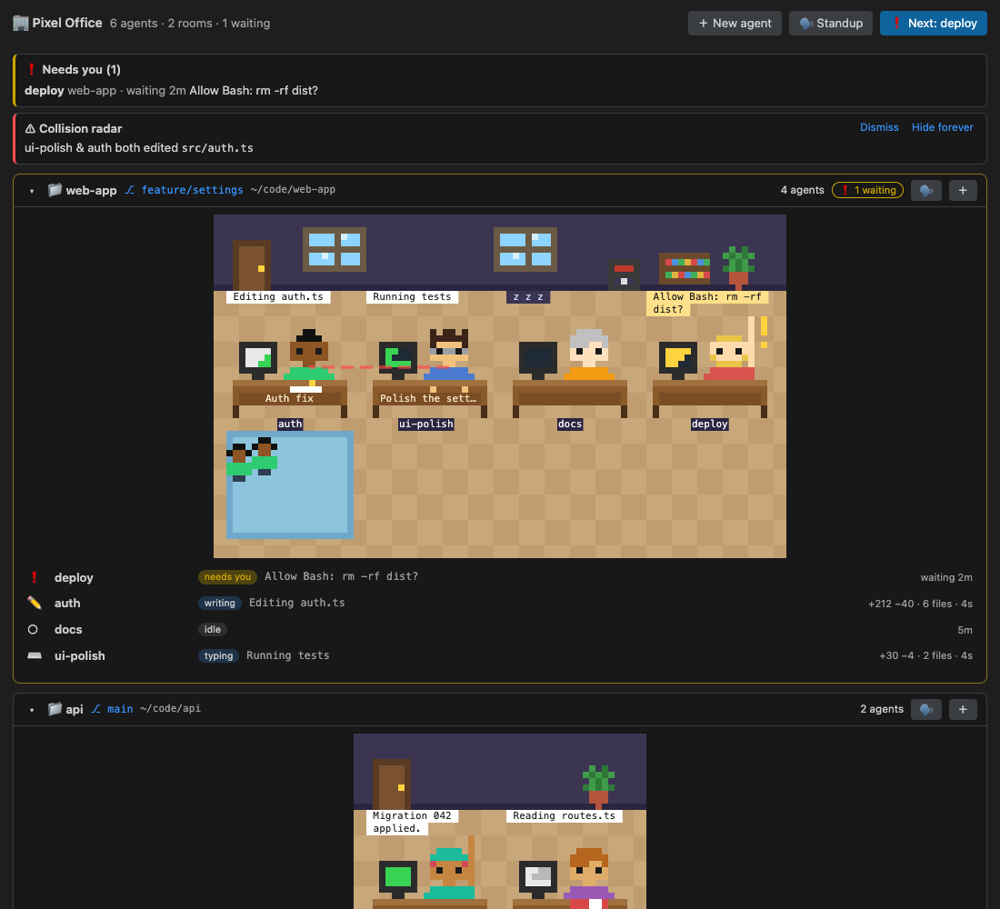
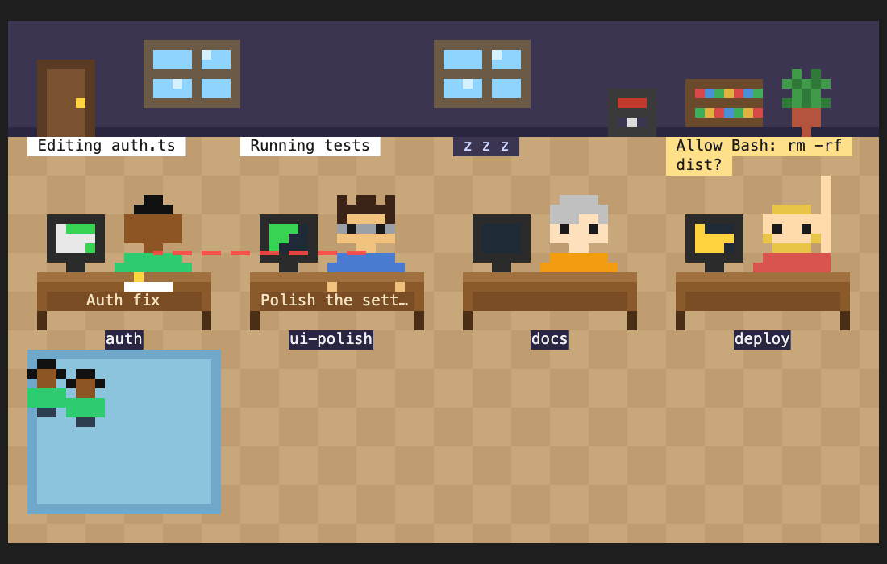
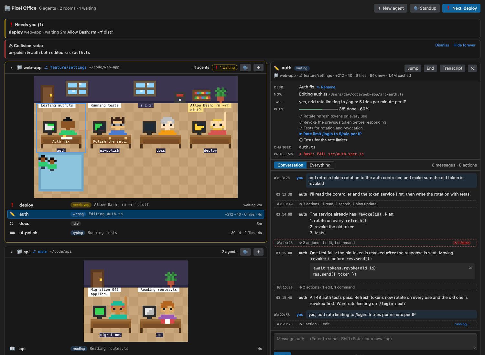
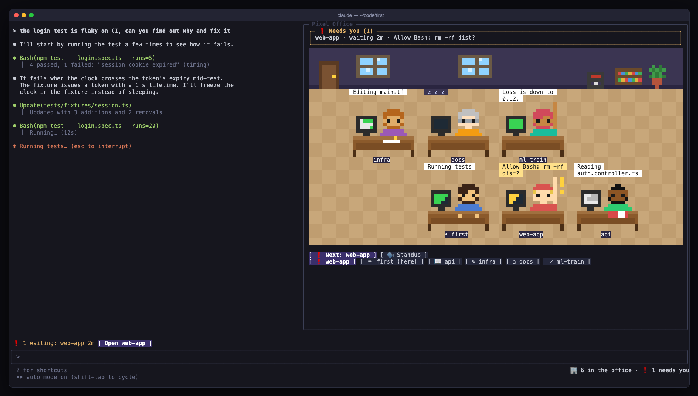
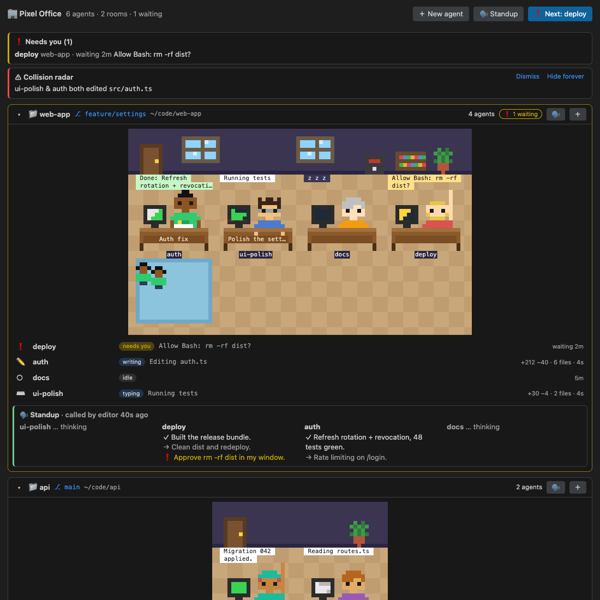
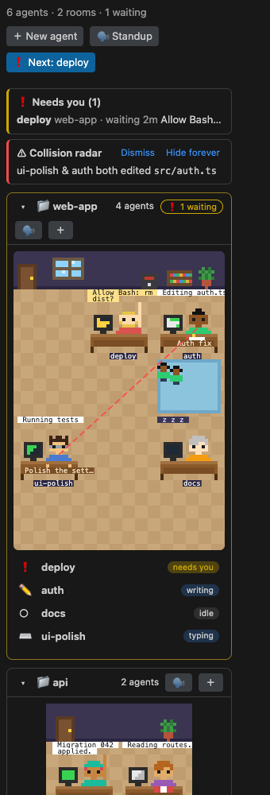
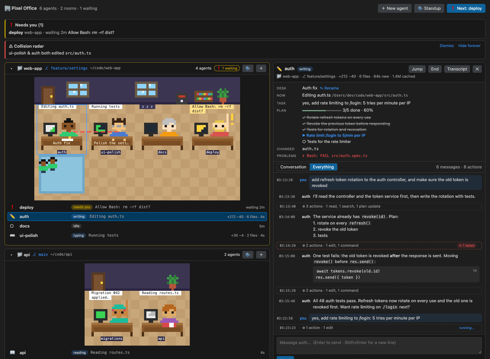
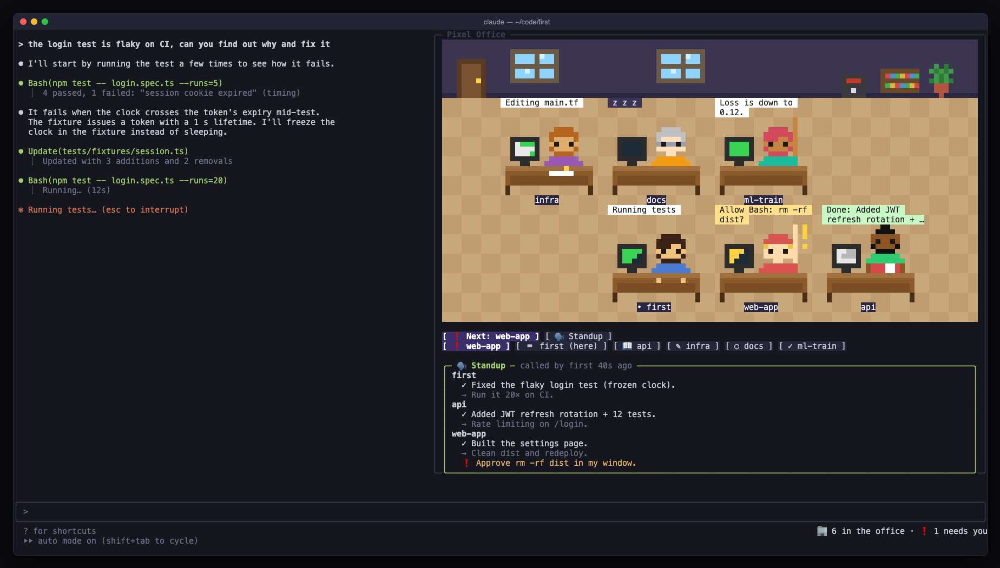
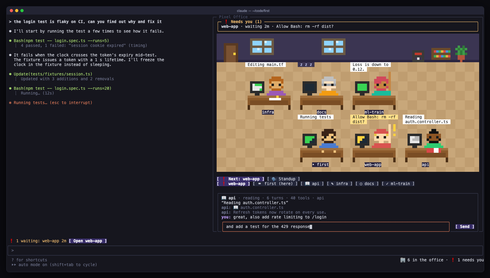

# Pixel Office for Claude Code

Run several Claude Code agents at once and see them all in one place: every session is a pixel-art
character at a desk, grouped into one office room per repository. You can see who is working on what,
who is waiting for you and who just finished, and you can talk to any of them with a click.

<video src="previews/demo.mp4" poster="previews/editor-panel-rooms.png" controls muted playsinline width="100%"></video>

▶ **[Watch the 22-second demo](previews/demo.mp4)**



## What it does

| | |
|---|---|
| **Rooms per repository** | Sessions in the same repo (git worktrees included) share a room, named after the repo, with its branch, its own office scene and a roster. |
| **Desk titles** | Each desk shows what that agent is working on. Rename it by hand, or clear it to go back to automatic. |
| **Plain-words activity** | Bubbles say *Running tests*, *Editing auth.ts*, *Committing*. The exact command is one hover away. |
| **Subagents** | Subagents are kids on a play mat under their agent's desk: up to 10 shown, the rest as **+N**. |
| **Needs you** | A session waiting for a permission or an answer raises its hand; a finished one keeps a hand up until its next prompt. You get a notification with **Jump**, a chime, a status-bar badge and a "Needs you" queue (oldest first). `Ctrl+Cmd+N` goes to the next one. |
| **Agent console** | Click an agent to open it. You see what it's doing now, your task, its plan with progress, the files it changed and recent failures, then the conversation. Tool calls are folded into "N actions" strips with failures flagged; open them for input and output, or switch to *Everything* to open them all. **End** stops the session and takes it off the floor. |
| **Talk to agents** | Type in the console; it becomes that session's next prompt. |
| **New agents** | **＋** in a room asks for a name and a task, then opens a Claude Code tab or terminal in that repo without taking you away from where you were. The new session takes the name and starts the task. The top-level **＋** can also start a new room in any folder. |
| **Full screen** | Each office has a full-screen button that appears while the pointer moves; `Esc` exits. |
| **Standup** | Per room or for everyone: each agent reports Done / Next / Blocked from its own conversation, and they take turns presenting in the scene. |
| **Collision radar** | Warns when two live agents edited the same file, with a red line between their desks. |
| **Insights** | Per-agent git changes (`+212 −40 · 6 files`) and token use (new vs. cached). |



*One office in full screen: desk titles (**Auth fix**), `auth`'s two subagents on the play mat, the collision
line between `auth` and `ui-polish`, and `deploy` with its hand up waiting for you.*



## Two parts, one office

```
 each Claude Code session                 your editor (Cursor / VS Code)
 ┌──────────────────────────┐            ┌─────────────────────────────────┐
 │ pixel-office  (the mod)  │  writes →  │ Pixel Office  (the extension)   │
 │ sees every tool call,    │ ~/.claude/ │ rooms, console, alerts, jump,   │
 │ answers standups, types  │ pixel-     │ git + transcript insights,      │
 │ your messages into the   │ office/ ←  │ new agents                      │
 │ session                  │  writes    │                                 │
 └──────────────────────────┘            └─────────────────────────────────┘
```

- **`pixel-office/`**: a Claude Code mod (a plugin of function hooks). It runs inside every session, writes
  that session's presence, delivers messages to it, answers standups and claims new-agent requests. It also
  draws the office inside the session itself, in the terminal and the desktop app.
- **`extension/`**: the Cursor / VS Code extension. It reads and writes the same folder and adds what only an
  editor can: the canvas office, the console, native notifications, jumping to terminals, git and transcript
  insights, and starting new agents.

Everything stays on your machine in `~/.claude/pixel-office/`.

## Install

**One paste**: copy this into Claude Code and it sets everything up for you:

```text
Set up Pixel Office for me (https://github.com/itsArnavPrasad/pixel-office).
1. Clone it into ~/pixel-office (or `git pull` there if it already exists).
2. Build the extension: cd ~/pixel-office/extension && npm install && npm run package
3. Install the built VSIX (extension/pixel-office-*.vsix) with `cursor --install-extension <file>`
   if the `cursor` CLI exists, otherwise `code --install-extension <file>`. If neither CLI is on
   my PATH, tell me to use Cmd+Shift+P → "Extensions: Install from VSIX…" and give me the path.
4. Tell me to reload the editor window and click **Enable** when Pixel Office asks (or run
   "Pixel Office: Enable in All Claude Code Sessions"), then open the 🏢 view in the activity bar.
   New Claude Code sessions will join the office.
If any step fails, show me the error and fix it before moving on.
```

**Cursor / VS Code (by hand)**
1. Build the extension: `cd extension && npm install && npm run package`
2. Install it: Cmd+Shift+P → **Extensions: Install from VSIX…** → `extension/pixel-office-0.2.0.vsix`
   (or `cursor --install-extension extension/pixel-office-0.2.0.vsix`), then reload the window.
3. Click **Enable** when asked, or run **Pixel Office: Enable in All Claude Code Sessions**. This copies the mod to
   `~/.claude/pixel-office/mod` and adds it to `CLAUDE_CODE_PLUGIN_DIRS` in `~/.claude/settings.json`
   (a backup is kept). New sessions join the office.
4. Open the 🏢 view in the activity bar, or **Pixel Office: Open Office**.

**Terminal only**: `claude --plugin-dir ./pixel-office`, then `/office` in the session.

## In the terminal

The mod draws the same office in the terminal (fullscreen layout), with chips, the needs-you band above the
prompt, standups and a dialogue box.



Commands inside a session: `/office` · `/office standup` · `/office name <name>` · `/office look [dev-1…dev-8]` ·
`/office alerts on|off` · `/office sound on|off`.

## Develop

```sh
./scripts/check.sh                      # the gate: everything below
claude plugin validate pixel-office     # the mod's manifest and hooks
claude plugin test pixel-office         # 98 mod tests (state machine, rooms, inbox, alerts, standup, scene, pane)
cd extension && npm test                # 37 extension unit tests (transcript, git, setup, store over a real folder)
node --test test/smoke.test.cjs         # the built extension against a fake vscode
node test/webview-harness.mjs test/out  # the webview in headless Chrome, screenshots included
node scripts/terminal-preview.mjs previews   # terminal renders from the real cell output
```

The README screenshots come from those last two: `previews/editor-*.png` are copies of the harness's
`test/out/panel-*.png`, `sidebar.png` and `fullscreen.png`. `previews/terminal-*.png` are written in place.

## More screenshots

| | |
|---|---|
|  |  |
| Standup for a room: Done / Next / Blocked | The activity-bar mini office |
|  |  |
| The console's *Everything* view, every tool call open | A standup in the terminal |
|  | |
| Talking to another agent from the terminal | |
