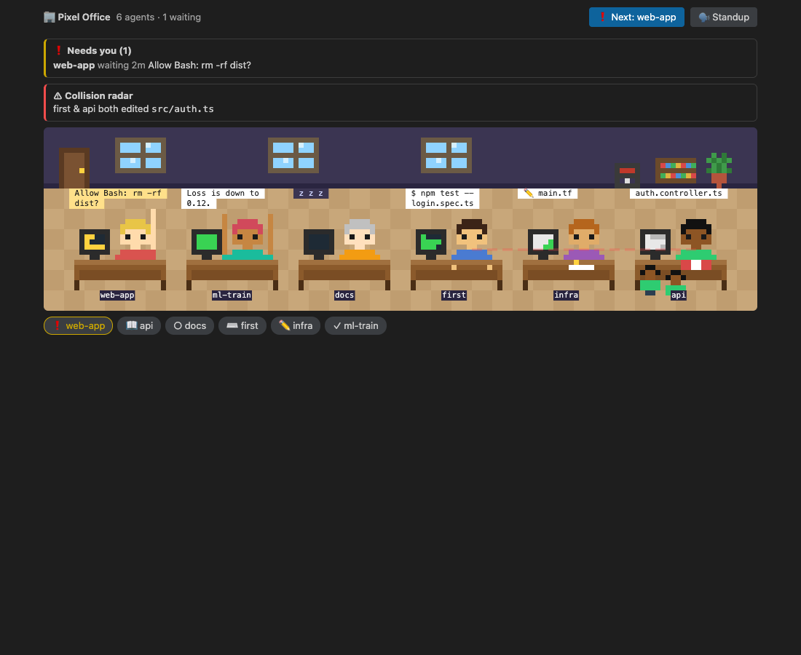
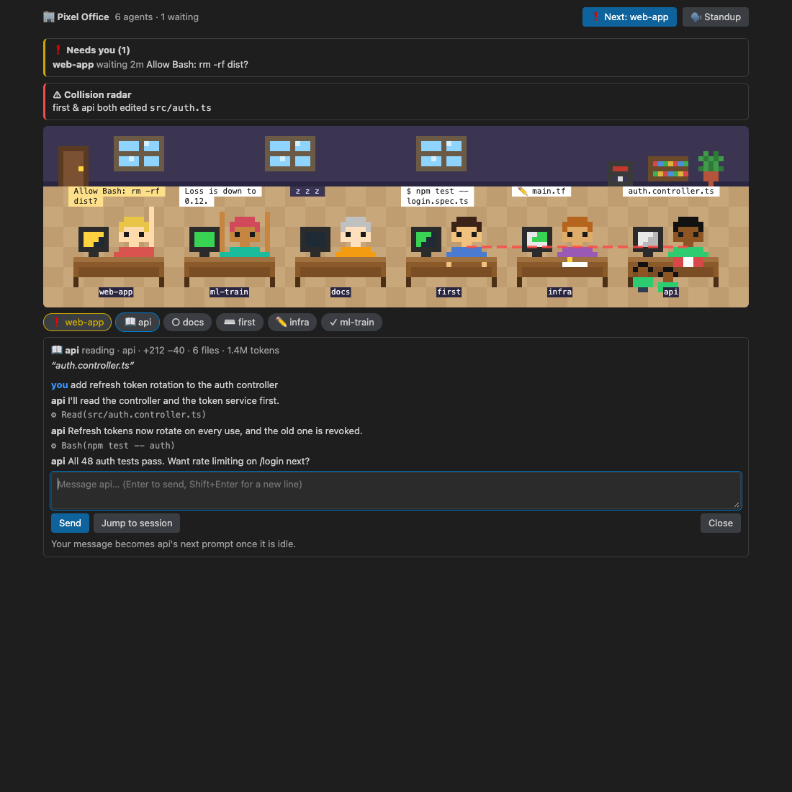
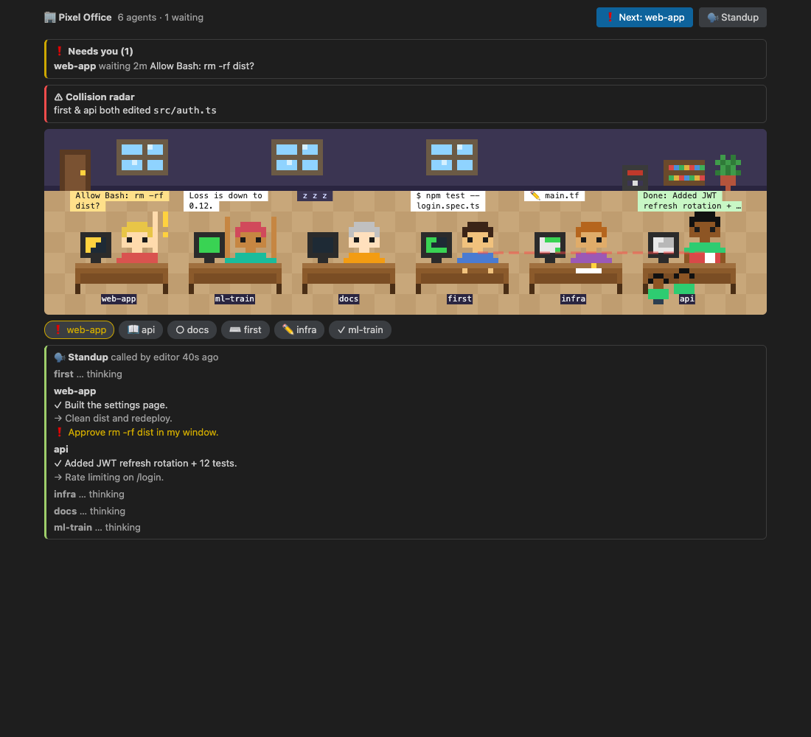
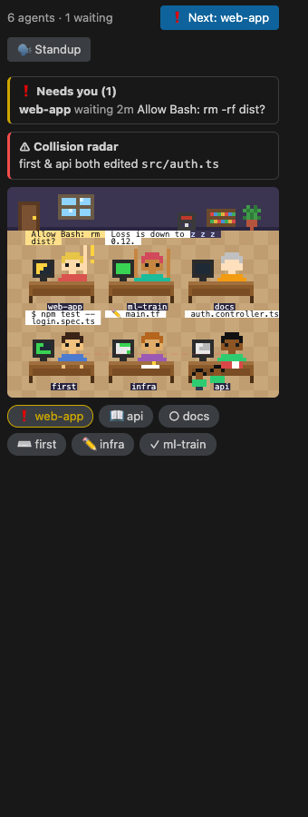

<div align="center">

# 🏢 Pixel Office

**Every Claude Code session you run, as a pixel-art coworker in one shared office.**

See who's typing, who's reading, who's stuck, and who needs you. Click a character to talk to it.




[What it does](#-what-it-does) · [Quick start](#-quick-start) · [How it works](#-how-it-works) · [Develop](#-develop) · [Customize](#-customize) · [For coding agents](#-for-coding-agents)

</div>

---

## ✨ What it does

When you run five Claude sessions across three repos, it's hard to tell which ones are working, which are finished, and which have been waiting on a permission prompt for ten minutes. Pixel Office puts all of them in one view.

| | |
|---|---|
| 🧑‍💻 **Live characters** | Each session acts out what it's doing: typing on `Bash`, flipping a book on `Read`/`Grep`, scribbling on `Edit`, walking to the bookshelf on `WebSearch`, spawning little interns for subagents, stretching when a turn finishes. |
| ✋ **Needs you** | When a session waits for a permission or an answer, its character raises a hand. You get a toast, a chime, an OS notification and a status-bar badge. `Ctrl+Cmd+N` (`Ctrl+Alt+N` on Linux/Windows) jumps to whoever has waited longest. |
| 💬 **Talk to them** | Click a character to read its recent conversation and send it a message. The message becomes that session's next prompt. |
| 📣 **Standup** | One button. Every session forks its own transcript and reports **Done / Next / Blocked**, then each one stands up and presents in turn. |
| ⚠️ **Collision radar** | Warns when two live agents have edited the same file. |
| 📊 **Insights** | Per-agent git diff stats (`+120 −30 · 4 files`) and token use. |
| 🏠 **Rooms** | Sessions are grouped by repository (worktrees included), so each repo gets its own room. |
| ➕ **New agent** | Pick a room, a name and an optional first task, and a fresh session walks in from the door. |

<table>
<tr>
<td width="50%"><br><sub><b>Click to talk.</b> Recent lines from the real transcript, plus a reply box.</sub></td>
<td width="50%"><br><sub><b>Standup.</b> Done / Next / Blocked from every session.</sub></td>
</tr>
</table>

### It runs in the terminal too

The same office is drawn with half-block characters inside Claude Code's own pane, at about 8 fps, with no extension needed.


<details>
<summary><b>More screenshots</b></summary>

<br>

| Terminal: dialogue | Terminal: standup |
|---|---|
|  |  |

| Sidebar mini view | Standup spotlight |
|---|---|
|  |  |


</details>

---

## 🚀 Quick start

Pixel Office has two parts, and you can use either one on its own:

| Part | Folder | What it is |
|---|---|---|
| **The mod** | [`pixel-office/`](pixel-office/) | A Claude Code plugin that runs inside every session. It publishes presence, receives messages, answers standups and draws the office in the terminal pane. |
| **The extension** | [`extension/`](extension/) | A VS Code / Cursor extension that reads the same shared folder and adds a 60 fps canvas office, notifications, terminal jumping, git insights and setup. It bundles the mod. |

### Option A: the editor extension (recommended)

```sh
git clone https://github.com/itsArnavPrasad/pixel-office.git
cd pixel-office/extension
npm install
npm run package                  # → pixel-office-0.1.0.vsix

cursor --install-extension pixel-office-0.1.0.vsix   # or: code --install-extension …
```

Then in the Command Palette run **Pixel Office: Enable in All Claude Code Sessions**. It:

1. copies the bundled mod to `~/.claude/pixel-office/mod`
2. adds that folder to `CLAUDE_CODE_PLUGIN_DIRS` in `~/.claude/settings.json`, after asking you first and keeping a backup at `settings.json.pixel-office.bak`

From then on, new Claude Code sessions join the office. **Pixel Office: Disable…** reverses it.

### Option B: the mod only (terminal)

```sh
git clone https://github.com/itsArnavPrasad/pixel-office.git
CLAUDE_CODE_PLUGIN_DIRS="$PWD/pixel-office/pixel-office" claude
```

Inside the session, type `/office`.

| Command | Effect |
|---|---|
| `/office` | Open the office pane |
| `/office standup` | Call a standup in every session |
| `/office name <name>` | Rename yourself in the office |
| `/office look [id]` | Change your character, or cycle through the looks |
| `/office alerts on\|off` | Toasts, chime and notification |
| `/office sound on\|off` | Chime only |

> [!NOTE]
> The mod uses Claude Code's plugin hooks API (`$.ui`, `$.fs`, `$.model.fork`, …), which is still early access and can change between releases. If something breaks after a Claude Code update, run `scripts/check.sh` first.

### Extension commands and settings

| Command | Shortcut |
|---|---|
| Pixel Office: Open Office | |
| Pixel Office: New Agent… | |
| Pixel Office: Go to Next Agent Waiting for You | `Ctrl+Cmd+N` / `Ctrl+Alt+N` |
| Pixel Office: Call a Standup | |
| Pixel Office: Enable / Disable in All Claude Code Sessions | |

| Setting | Default | |
|---|---|---|
| `pixelOffice.notifications` | `true` | Notify when an agent starts waiting |
| `pixelOffice.sound` | `true` | Chime (macOS) |
| `pixelOffice.showTokens` | `true` | Read token use from transcripts |

---

## 🧠 How it works

A mod runs **inside one session**, so there's no built-in view of every session. Instead, every session runs the same mod and they share state through a folder. There's no server and no daemon, so nothing can crash and take the others down with it.

```
  Session A (mod)        Session B (mod)        Session C (mod)        Cursor / VS Code (extension)
   hooks → own record     hooks → own record     hooks → own record     reads everything, writes inbox/standup/spawn
        │                      │                      │                          │
        └──────────────┬───────┴──────────────────────┴──────────────────────────┘
                       ▼
        ~/.claude/pixel-office/
          agents/<sessionId>.json        presence + state, heartbeat every 2 s
          inbox/<sessionId>/<ts>.json    messages → that session's next prompt
          standup/<reqId>/…              standup request + one answer per session
          spawn/<id>.json                "a new agent is coming to this room" tickets
          ui/<instance>.json             editor heartbeats (alerts defer to the editor)
          mod/                           the installed mod
```

- **One writer per file.** Each session writes only its own record, and every inbox message gets a unique file name, so there are no write races. Readers tolerate partial or garbage JSON.
- **Liveness.** A session that misses heartbeats for 20 s shows as `away`, and it's pruned after 10 min.
- **One chime, not N.** Only the *alert leader* plays the chime: the earliest-arrived live session, or an open editor window if there is one.
- **State priority:** `needs-you` > `stressed` > working states > `done` > `idle`.

### 🔒 Privacy and safety

- Everything stays in `~/.claude/pixel-office/` on your machine. Nothing is sent anywhere.
- The office **never approves permissions**. The ✋ only tells you where to look.
- A message is only ever delivered as a prompt, by the receiving session's own mod.
- Bubbles strip ANSI and control characters, are cut to 60 characters, and redact obvious secrets (`*_KEY=…`, `Bearer …`, `--password …`).
- OS notifications pass their text as `osascript` argv items, never as script source.

---

## 🛠 Develop

### Prerequisites

- Node 22.18+ or 23.6+ (tests run `.ts` directly through native type stripping and `module.registerHooks`)
- Claude Code (the `claude` CLI, with plugin hooks support)
- VS Code or Cursor, for the extension
- Optional: Google Chrome, for the headless webview test and preview renders

```sh
npm install                       # root: TypeScript for the mod
(cd extension && npm install)     # extension: esbuild, vsce, types
```

### The gate ✅

Run **one command** before calling anything done:

```sh
scripts/check.sh
```

It runs, in order:

| Step | What |
|---|---|
| `claude plugin validate pixel-office` | the mod's manifest and hooks |
| `tsc -p .` | the mod's types (strict, `noUncheckedIndexedAccess`) |
| `claude plugin test pixel-office` | the mod's tests (mocked clock, no real fs or network) |
| `tsc -p extension` | the extension's types |
| `npm test` | the extension's `node:test` unit tests |
| `node build.mjs` | bundles the extension and webview, and copies the mod in |
| `smoke.test.cjs` | loads the real bundle against a fake `vscode` |
| `webview-harness.mjs` | renders the webview in headless Chrome (if installed) |

The script finds the `claude` binary bundled with the Cursor/VS Code Claude extension, because the one on `PATH` may be older. Override it with `CLAUDE=/path/to/claude scripts/check.sh`.

### Day-to-day loops

```sh
# mod: hot-reloads in a running session
CLAUDE_CODE_PLUGIN_DIRS="$PWD/pixel-office" claude

# extension
cd extension
npm run build && npm test         # rebuild + unit tests
npm run typecheck
npm run package                   # → .vsix
# or press F5 in VS Code with extension/ open to start an Extension Development Host

# render preview PNGs/SVGs from the real renderer (no Claude needed)
node scripts/preview.mjs previews/
node scripts/terminal-preview.mjs previews/
```

### Project map

```
pixel-office/                    THE MOD (Claude Code plugin)
  .claude-plugin/plugin.json     manifest
  hooks/
    register.tsx                 the only engine-facing file: events → core → $.fs / $.state / $.ui
    core/                        PURE: data in, data out. No fs, network or process.
      agent.ts                   AgentRecord, state machine, priorities, timeouts
      signals.ts                 tool call / event → { state, bubble }
      roster.ts                  merge agents/*.json, stale/away/prune, stable desk assignment
      rooms.ts                   group sessions by repository
      inbox.ts                   message encode/decode/validate, dedupe, cursor
      alerts.ts                  waiting queue, alert leader, new/reminder/cleared episodes
      standup.ts                 prompt, report parser, request/answer files, presenter
      scene.ts                   office layout + drawOffice()
      pixels.ts  sprites.ts      frame buffer, blitting, string-art sprites + palette
      encode.ts                  frame → terminal Raster cells / SVG
      text.ts                    bubble wrapping, control stripping, secret redaction
  tests/                         core, features, mod (mounted UI), render
  sounds/chime.wav

extension/                       THE EDITOR EXTENSION
  src/
    extension.ts                 activate(): wiring, commands, status bar, notifications
    store.ts                     watches + polls the office folder → Snapshot
    protocol.ts                  webview ⇄ host messages (all validated)
    transcript.ts                tails ~/.claude/projects/*/<id>.jsonl → recent lines + tokens
    git.ts  insights.ts          diff stats per cwd
    collisions.ts                overlapping recently edited files between live agents
    jump.ts                      process-ancestry match → focus the right terminal
    peers.ts                     editor-window leader election (only one window notifies)
    setup.ts                     settings.json merge/unmerge + mod copy
    ui/panel.ts                  webview panel + sidebar provider
  webview/
    main.ts                      canvas renderer (reuses core drawOffice), hit-testing, cards, dialogue
    geometry.ts  format.ts       pure layout math and formatting
  media/office.css
  test/                          node:test suites + smoke + headless webview harness
  build.mjs                      esbuild ×2, then copies ../pixel-office into mod/

scripts/check.sh                 THE GATE
scripts/preview.mjs              sample offices → PNG/SVG
scripts/terminal-preview.mjs     terminal mock-ups from the mod's real Raster cells
previews/                        the screenshots in this README
PLAN.md                          the full design doc: state table, contracts, phases, risks
```

---

## 🎨 Customize

**Add a character state or tool mapping:** edit [`signals.ts`](pixel-office/hooks/core/signals.ts) to map the tool name to a state and bubble, then add a test row to [`tests/core.test.ts`](pixel-office/tests/core.test.ts).

**Draw new art:** sprites are string art plus a palette in [`sprites.ts`](pixel-office/hooks/core/sprites.ts). The render tests check that every frame has its declared size and every character is in the palette, so a typo fails the build instead of rendering garbage. Run `node scripts/preview.mjs previews/` to see the result.

**Change the office layout:** desks, door, windows and props are placed in [`scene.ts`](pixel-office/hooks/core/scene.ts). Both the terminal and the canvas use the same `drawOffice()`, so a change shows up on every surface.

**Add a webview feature:** add the message type to [`protocol.ts`](extension/src/protocol.ts) and validate it there, handle it in [`extension.ts`](extension/src/extension.ts), and draw it in [`webview/main.ts`](extension/webview/main.ts).

**Change the on-disk format:** records are schema `v: 1`. New fields must be **optional**, and `parseRecord` fills in defaults so older sessions still parse. Update both readers: the mod's `roster.ts` and the extension's `store.ts`.

---

## 🤖 For coding agents

Read this section before you change anything.

**Start here:** [`PLAN.md`](PLAN.md) has the state table, data contracts, safety rules and the reasoning behind each decision. This README is the summary.

**Definition of done:** `scripts/check.sh` exits 0. No exceptions.

**Invariants. Don't break these:**

1. **`core/` is pure.** No `$`, no `fs`, no `process`, no `Date.now()` (take `now` as an argument). This is what makes the tests deterministic, and it's why the extension can import core directly.
2. **`register.tsx` stays thin.** It wires events to core. Logic goes in `core/`, with a test.
3. **Hooks never block the session.** Every hook calls `next(e)`, and failures are caught and logged.
4. **Only `extension.ts` and `ui/*` import `vscode`.** Everything else in `extension/src` is unit-testable under plain Node.
5. **Validate every file read and every webview message.** A malformed file is skipped, never thrown.
6. **One writer per file.** Never write another session's record.
7. **Stay inside `~/.claude/pixel-office/`.** Deletes go through an allow-list on that root.
8. **Never approve permissions on a session's behalf.**
9. **Schema stays `v: 1`, with only optional additions.**

**Where to look:**

| Task | Files |
|---|---|
| A tool shows the wrong animation | `core/signals.ts`, `tests/core.test.ts` |
| Characters overlap or desks look wrong | `core/scene.ts`, `core/roster.ts`, `tests/render.test.ts` |
| Alerts fire twice or not at all | `core/alerts.ts`, `extension/src/peers.ts` |
| Standup answer parsed badly | `core/standup.ts` `parseReport` |
| Dialogue shows the wrong lines | `extension/src/transcript.ts` |
| Jump focuses the wrong terminal | `extension/src/jump.ts` |
| Settings.json got mangled | `extension/src/setup.ts`, `test/pure.test.ts` |

**Testing pattern:** tests are plain `node:test` and assert-based, with a mocked clock and in-memory fakes. Follow the existing files rather than adding a framework.

---

<div align="center">
<sub>MIT licensed · built with Claude Code, for Claude Code</sub>
</div>
